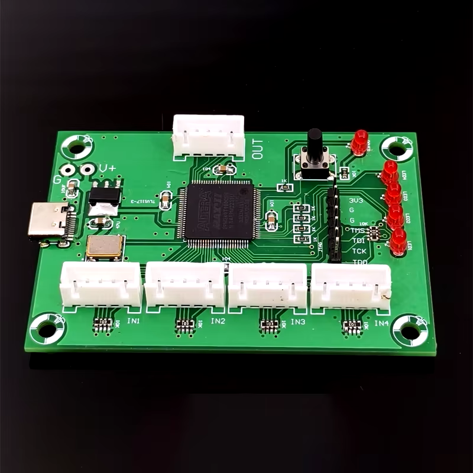

## Introduction
Firmware file from Chinese board for I2S 4to1 mux based on CPLD Altera MaxII EPM240T100C5N

* [Aliexpress link 1](https://pl.aliexpress.com/i/32948007762.html)
* [Aliexpress link 2](https://pl.aliexpress.com/item/1005006926563859.html?spm=a2g0o.order_list.order_list_main.17.76261c24lJovuH&gatewayAdapt=glo2pol&dp=0e20b351-d530-46f1-bf66-48ac34c85b2e&af=5f979ce5d915b86bee3f7002&aff_fcid=cb8db5fba77c410d9834808adc40a56a-1730490379885-08342-_oFqSEft&aff_fsk=_oFqSEft&aff_platform=api-new-link-generate&sk=_oFqSEft&aff_trace_key=cb8db5fba77c410d9834808adc40a56a-1730490379885-08342-_oFqSEft&terminal_id=8fd15fa5038f46dfb5af8c11e75f27c2&afSmartRedirect=y)
  
